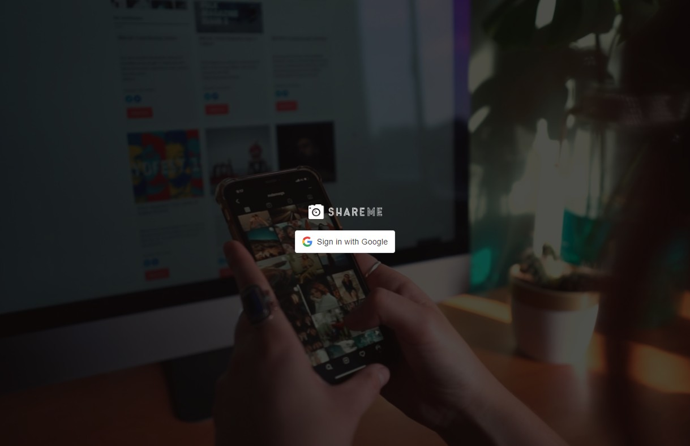
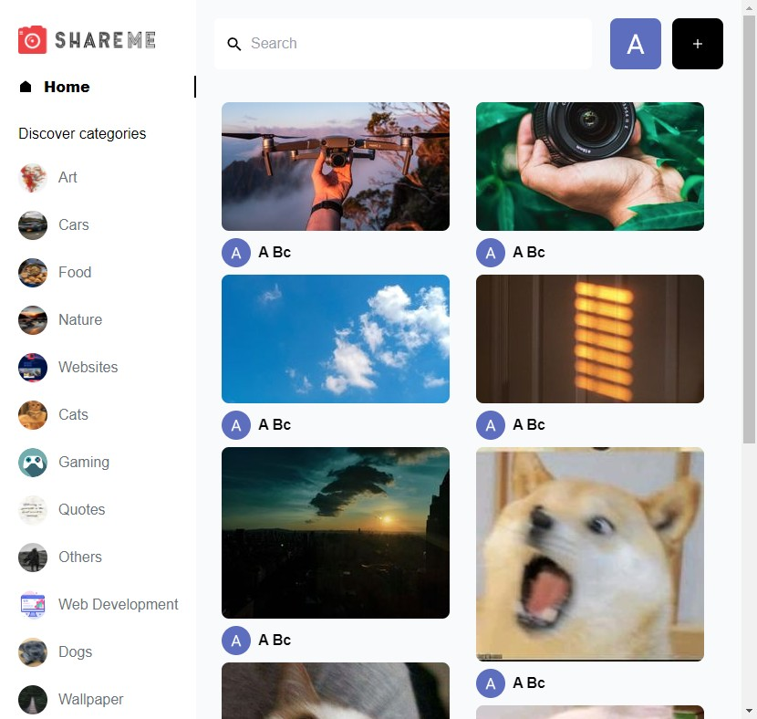
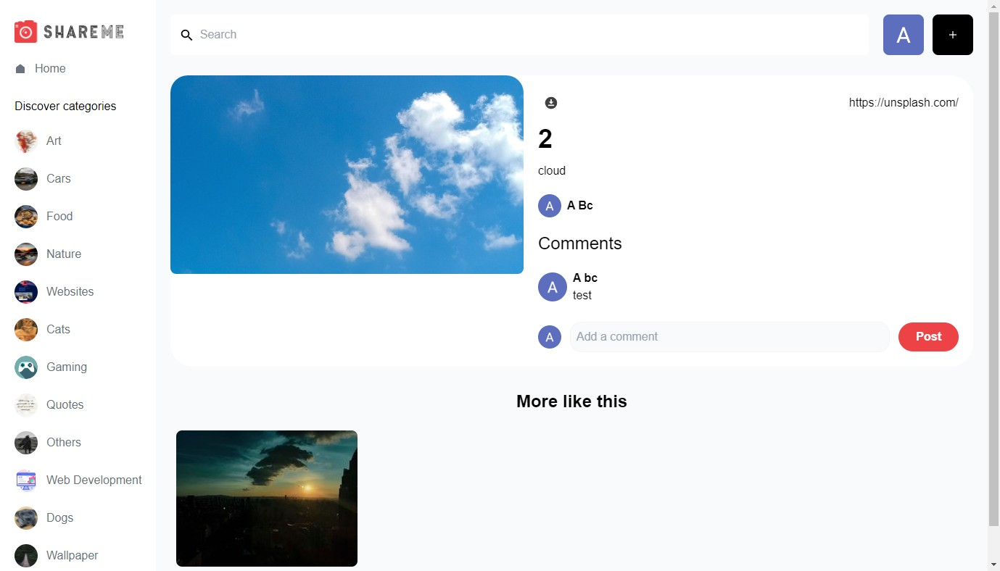
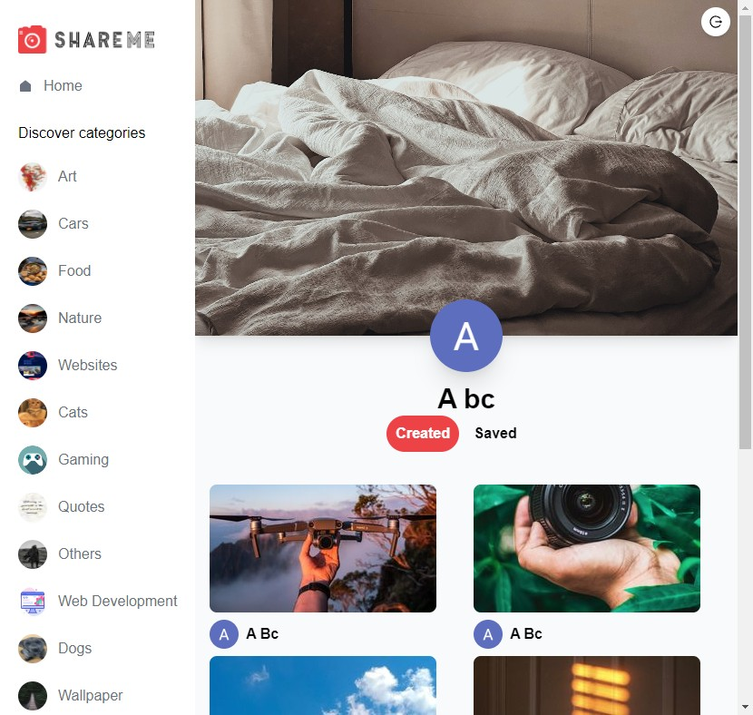

<h2 align='center'>
<b>ShareMe</b> &nbsp; &nbsp;

</h2>

A pinterest like social media platform developed using [Sanity CMS](https://www.sanity.io/) as the backend and [react](https://reactjs.org/) as the frontend based on the tutorial of [Modern React Web Development Full Course](https://www.youtube.com/watch?v=XxXyfkrP298).

- [Vite](https://vitejs.dev/)
- [TypeScript](https://www.typescriptlang.org/)
- [ESLint](https://eslint.org/)
- [tailwindcss](https://tailwindcss.com/)
- [nanostores](https://github.com/nanostores/nanostores) - state management
- [React OAuth2](https://github.com/MomenSherif/react-oauth) - Google OAuth used for user authentication

## Features

- user login/logout
- create new pins
- delete pins
- save pins
- view created / saved pins
- search pins
- comments

## Screenshots

### Login page

### Login page

### Home page

### Pin details page

### User profile page

